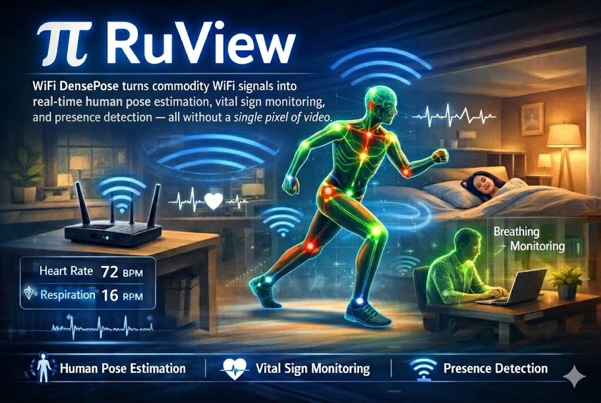
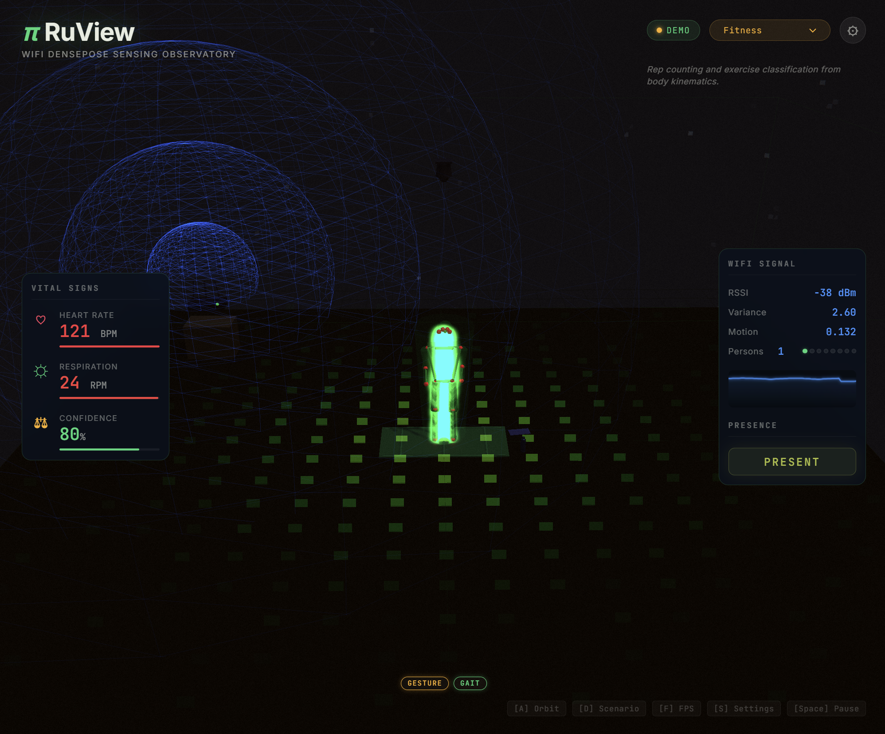

# RuView（π RuView）仓库总结与可落地产品方向

> 面向产品经理/业务同学的通俗解读：这不是一个“论文复现 demo”，而是一套 **把 WiFi 变成空间传感器（Spatial Intelligence）** 的平台化工程：从 ESP32 固件采集 CSI，到信号处理、训练、实时服务端，再到桌面端运维与可插拔边缘模块（WASM）。



---

## 1. 一句话结论

RuView 的核心价值是：**用廉价硬件（ESP32-S3）把无线信号扰动变成“人是否在、在做什么、生命体征如何、在空间中怎么动”的实时数据**，并提供一套“端侧优先”的部署形态（无摄像头、可离线、低带宽、可规模化）。

---

## 2. 它能“感知”什么（用户能理解的能力表）

来自仓库主 README 的能力宣称可概括为：

1. **存在与人数**：房间是否有人、粗略人数统计、进出变化趋势。
1. **生命体征**：呼吸、心率（无需穿戴、可在黑暗中、可穿墙）。
1. **活动识别**：走路/坐下/跌倒/手势等（通过时序 CSI 特征）。
1. **空间/环境指纹**：房间识别、家具移动/环境漂移检测。
1. **姿态估计（17 个 COCO 关键点）**：在“无摄像头部署”目标下，提供 WiFi → 人体关键点的推断路径（并支持**训练阶段用摄像头做 teacher**，部署阶段去摄像头）。
1. **灾害救援（WiFi-Mat）**：面向“废墟生命体征/定位/分诊”的场景化子系统。

---

## 3. 这套系统“长什么样”（端到端架构）

用一张图把链路讲清楚：

```text
WiFi 环境（路由器/邻居 AP 作为“照明源”）
  │
  │ 人体/物体扰动无线传播路径（多径、散射、Fresnel 区）
  ▼
ESP32-S3 采集 CSI（多节点 Mesh 可做多视角/多频段）
  │
  │（端侧优先：默认只上传“压缩后的特征态”，而不是全量原始 CSI）
  ▼
Sensing Server（Rust, Axum）
  │  ├─ REST：/health /api/v1/pose/current /api/v1/vital-signs /api/v1/sensing/latest ...
  │  ├─ WebSocket：/ws/sensing（实时推送）
  │  └─ UI：Three.js Dashboard / Observatory（同端口静态资源）
  ▼
应用侧：楼宇/医疗/安防/零售/灾害救援等业务系统（告警、报表、自动化）
```

### 3.1 为什么强调“端侧优先”

仓库在固件架构 ADR-081 中给了一个关键工程策略：**把“默认上行数据”从原始 CSI（高带宽）变成 60 字节的 `rv_feature_state_t`（低带宽）**，目标是把多节点规模化变成可行。

示意：

```text
传统做法：每个节点持续上传原始 CSI → 带宽/稳定性/隐私/运维成本很高
RuView 做法：节点先在端侧提取 motion/presence/呼吸心率/异常/漂移等 → 默认上传 60B 状态包（1~10Hz）
```

这对产品落地很关键：它直接决定 **部署规模上限、网络成本、以及“边缘 AI 盒子/网关”的形态**。

---

## 4. 仓库模块地图（你要先知道它到底包含哪些“产品件”）

从目录结构可归纳为 5 大块：

1. **固件（firmware）**  
   ESP32-S3 侧 CSI 采集、端侧特征提取、Mesh/TDM、WASM runtime、OTA、以及 QEMU 测试体系。

2. **Rust v2 工作区（v2/crates/**…）  
   - `wifi-densepose-sensing-server`：核心后端（UDP ingest → 处理 → WebSocket/REST/UI）。  
   - `wifi-densepose-signal`：信号处理与特征（如相位清理、滤波、BVP、Fresnel 等）。  
   - `wifi-densepose-train`：训练管线（含多项 ADR 提到的训练/评估组件）。  
   - `wifi-densepose-vitals`：更完整的生命体征处理管线（文档显示部分能力尚未完全接入 server）。  
   - `wifi-densepose-wasm-edge`：**端侧可插拔模块集合**（65 个 WASM 模块、强调 no_std、固定预算）。  
   - `wifi-densepose-desktop`：Tauri 桌面运维端（发现节点、刷机、OTA、下发 WASM、看实时数据、Mesh 拓扑）。

3. **UI（ui/ + dashboard/）**  
   Three.js 可视化；同时仓库也提供 GitHub Pages demo 链接作为展示。

4. **Docs（docs/）**  
   - ADR（大量“为什么这样做”的决策记录）  
   - DDD（按领域划分的模型与边界）  
   - user-guide / build-guide / troubleshooting（更贴近落地与运维）  
   - qe-reports（质量/风险评估，非常“产品化”）

5. **资产与演示（assets/）**  
   包含 README 展示图、demo zip、仪表盘素材等，适合做“图文并茂”的总结引用。



---

## 5. 哪些能力“已经是工程形态”，哪些更像“研究/路线图”

为了避免只看 README 的宣传口径，我按“可落地程度”做了分层：

### 5.1 已经具备可产品化形态（MVP 可做）

1. **端到端数据链路**：ESP32 → UDP → Sensing Server → WebSocket/UI（文档有可运行的 Docker/本地命令与 API）。
1. **生命体征/存在检测**：作为“房间级”能力更容易闭环验证、也更适合早期收费。
1. **桌面端运维能力**：节点发现、刷机、OTA、WASM 下发等，说明团队在往“可部署系统”靠，而非只做算法。
1. **WASM 边缘模块体系**：这是非常“平台化”的设计，等价于“在传感器上跑一堆小应用”。
1. **QEMU 固件测试体系**：说明其目标是走长期工程迭代，而非一次性论文复现。

### 5.2 正在打磨/强依赖数据闭环（可做但需谨慎）

1. **姿态估计质量**：仓库明确提出“训练阶段用摄像头做 ground-truth、部署阶段去摄像头”，这条路线合理，但最终质量取决于数据采集与训练闭环（ADR-079）。
1. **多节点融合与多人分离**：涉及复杂场景与鲁棒性，工程上需要大量实测与指标体系（仓库也在 QE 报告里提示实时性/接口/平台风险较高）。

### 5.3 更偏前瞻/研究（适合做差异化叙事，但不建议一开始就卖）

1. **“穿墙 3D 点云融合”（相机深度 + WiFi CSI + mmWave）**：很酷，但产品化门槛高（硬件与场景约束多）。
1. **灾害救援 WiFi-Mat**：意义重大，但属于安全关键场景；需要极强的验证与合规/背书，适合与机构合作做项目制落地。

---

## 6. 它的技术“护城河”在哪（产品经理视角）

如果只看 WiFi 感知领域，很多项目停在“能跑出一个曲线/热图”。RuView 的护城河更像：

1. **端侧数据预算与规模化策略**：把默认上行变成“特征态”，让 50+ 节点部署在网络上可行。
1. **可编程边缘模块（WASM）**：把“算法能力”产品化为可分发的模块生态（类似手机 App 的概念，只是运行在传感器上）。
1. **运维与测试体系**：固件 QEMU、桌面运维端、文档化 ADR/DDD，说明对“交付”有明确意识。
1. **训练闭环路线**：强调摄像头只用于训练 teacher，部署阶段保持无摄像头隐私优势（商业叙事很好）。

---

## 7. 可落地的产品方向（按优先级给你 6 条）

你没有指定“重点行业”，我按“从易到难、从快到慢”的商业化路径给一个产品路线图。每条都给：目标客户、核心价值、落地形态、关键指标（KPI）、主要风险。

### 方向 A（优先级 1）：隐私友好的“房间级存在与睡眠呼吸监测”（ToB2C / ToB）

1. 目标客户：养老看护机构、睡眠健康服务商、家庭看护（老人/婴幼儿）、酒店（睡眠体验）。
1. 核心价值：**无摄像头、无穿戴**，降低依从性问题；夜间/遮挡可用。
1. 落地形态：1-2 个 ESP32-S3/房间 + 本地网关/小主机；提供 App/面板 + 告警（呼吸暂停、长时间不动、离床）。
1. KPI：存在检测准确率、呼吸检测稳定性（CV/误差）、误报率、告警延迟。
1. 风险：不同房型/材料差异大；需要“快速自适应/校准”体验（否则安装成本高）。

### 方向 B（优先级 2）：办公/商业地产“空间利用率 + HVAC 节能”（强 ToB）

1. 目标客户：物业、园区、企业行政、楼宇能源管理公司。
1. 核心价值：比 PIR 更稳（可穿墙、覆盖死角少），比摄像头合规成本低；直接和节能收益挂钩。
1. 落地形态：按区域布点（现有 AP + 少量 ESP32/区域），提供 occupancy API + 报表 + BMS 对接。
1. KPI：房间占用识别准确率、能耗节省、部署/运维成本（每 1000㎡ 成本）。
1. 风险：与现有楼控系统集成周期；需要明确“边界”（只能给到房间/区域级，而非像摄像头那样精细）。

### 方向 C（优先级 3）：零售/餐饮“客流与排队/停留热区”（合规优势明显）

1. 目标客户：连锁零售、餐饮、商超、展会。
1. 核心价值：不用摄像头就能给出客流/停留/排队趋势，规避隐私争议。
1. 落地形态：多 AP/多节点覆盖，输出区域客流、停留时间、排队长度估计，接入 BI。
1. KPI：客流与排队估计误差、覆盖面积/单店成本、数据稳定性。
1. 风险：多人密集场景物理上限（需要教育客户“不是精确计数器”，而是趋势+区间）。

### 方向 D（优先级 4）：工厂/仓储“人员安全与禁入区”（ToB，价值强）

1. 目标客户：制造工厂、仓储物流、矿井/隧道等高危环境。
1. 核心价值：粉尘/弱光/遮挡条件下，比摄像头可靠；比穿戴更少依赖人员配合。
1. 落地形态：禁入区/叉车通道布点，输出 presence/approach/loitering，联动声光告警。
1. KPI：误报率、漏报率、告警时延、覆盖可靠性（掉线/漂移）。
1. 风险：电磁环境复杂；需要更强的抗干扰和现场部署 SOP。

### 方向 E（优先级 5）：开发者平台化产品“WiFi Sensing SDK + Edge Module Store”

1. 目标客户：做楼宇/安防/健康的硬件与方案商、开发者生态。
1. 核心价值：把 RuView 的复杂度封装成“模块/SDK”，卖工具链与生态，而不是卖单一场景应用。
1. 落地形态：
   - 标准化设备端：节点发现、OTA、WASM 下发、日志与健康
   - 标准化云/边：统一 API/WebSocket schema、数据回放、训练流水线
   - 模块商店：按场景上架 WASM modules（睡眠、跌倒、排队…）
1. KPI：开发者留存、模块安装量、生态收入（分成/订阅）。
1. 风险：产品化门槛高；需要定义清晰的“模块接口契约”和稳定性等级。

### 方向 F（优先级 6）：政府/应急“灾害救援 WiFi-Mat”

1. 目标客户：消防、应急管理、城市救援队、军警。
1. 核心价值：在不破拆的前提下快速“找生命体征/定位/分级”，提升救援效率。
1. 落地形态：便携式套件（多节点 + 网关 + 平板 UI），提供分区扫描、定位、分诊、告警。
1. KPI：不同材料/深度下的检出率（尤其漏报）、定位误差、部署时间。
1. 风险：安全关键系统，需要大量实测、认证、背书与责任边界设计；更适合项目制 + 联合研发。

---

## 8. 建议的产品落地路线图（90 天可做什么）

如果目标是“尽快验证可收费价值”，我建议：

1. **先选一个“房间级”场景**（A 或 B）：睡眠呼吸/存在告警 或 办公空间占用 + 节能。
1. 以 **“端侧特征态 + 简化安装校准流程”** 为核心交付，而不是一上来卖“WiFi 人体姿态”。
1. 用桌面端（或 Web）把“部署/诊断/升级”体验打磨成产品护城河：这比算法更容易赢。
1. 同步建设指标体系：准确率、误报/漏报、漂移、掉线、P95 延迟、安装耗时。

---

## 9. 图示与素材（文档内可引用）

仓库自带多张可直接引用的图片/压缩包（便于你做分享材料）：

1. `assets/ruview-small-gemini.jpg`：README 顶部 Banner 图  
1. `assets/v2-screen.png`：UI 截图（Dashboard/Live Demo）  
1. `assets/wifi-densepose-demo.zip`：演示素材包（可用来做内部宣讲）  
1. `assets/wifi-mat.zip`：WiFi-Mat 相关素材  

---

## 10. 你下一步可以怎么用它（最实用的“上手路径”）

### 10.1 不买硬件先验证（模拟模式）

1. Docker 起服务，打开 UI 看全链路：
   - `docker run -p 3000:3000 -p 3001:3001 ruvnet/wifi-densepose:latest`
   - 打开 `http://localhost:3000`

### 10.2 有 ESP32 再上真数据（CSI）

1. 启动 server：`--source esp32`，监听 UDP 5005。
1. 刷固件 + provision，把目标 IP 指向 server 所在机器。
1. WebSocket 连接 `/ws/sensing` 获取实时流，前端/业务侧按需消费。

---

## 11. 关键风险（产品化视角的“坑位提示”）

结合仓库的 QE 报告与文档内容，产品落地前需要明确三件事：

1. **实时性与稳定性指标**：目标 20Hz/多节点的端到端延迟、P95/P99 是否可控（这是能不能商用的硬门槛）。
1. **跨环境泛化与校准成本**：不同房型/材料/摆放方式影响很大，必须把“校准”做成产品流程，否则交付成本会爆炸。
1. **合规与责任边界**：医疗/救援等场景不能只靠技术 demo，需要明确“辅助决策”定位与配套 SOP。

---

## 12. 结语：它最适合切入的产品形态

把 RuView 当作“下一代隐私友好型空间传感平台”更合适：  
**先用存在/生命体征/行为告警做业务闭环与 ROI，再逐步把姿态估计、多节点融合、点云等高级能力作为增量卖点。**

---

## 13. 参考依据（我重点研读的仓库资料）

本总结主要基于仓库中的这些内容整理：

1. `README.md`
1. `CHANGELOG.md`
1. `docs/user-guide.md`
1. `docs/readme-details.md`
1. `docs/adr/README.md`
1. `docs/ddd/README.md`
1. `docs/adr/ADR-079-camera-ground-truth-training.md`
1. `docs/adr/ADR-081-adaptive-csi-mesh-firmware-kernel.md`
1. `docs/edge-modules/README.md`
1. `docs/wifi-mat-user-guide.md`
1. `docs/qe-reports/06-product-assessment-sfdipot.md`
1. `v2/crates/wifi-densepose-sensing-server/README.md`
1. `v2/crates/wifi-densepose-desktop/README.md`
